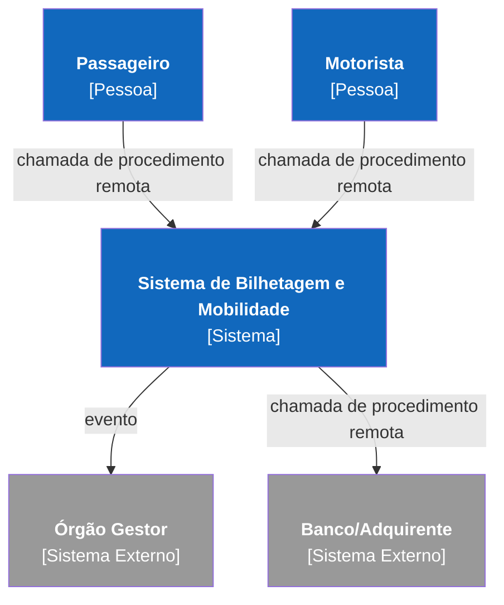
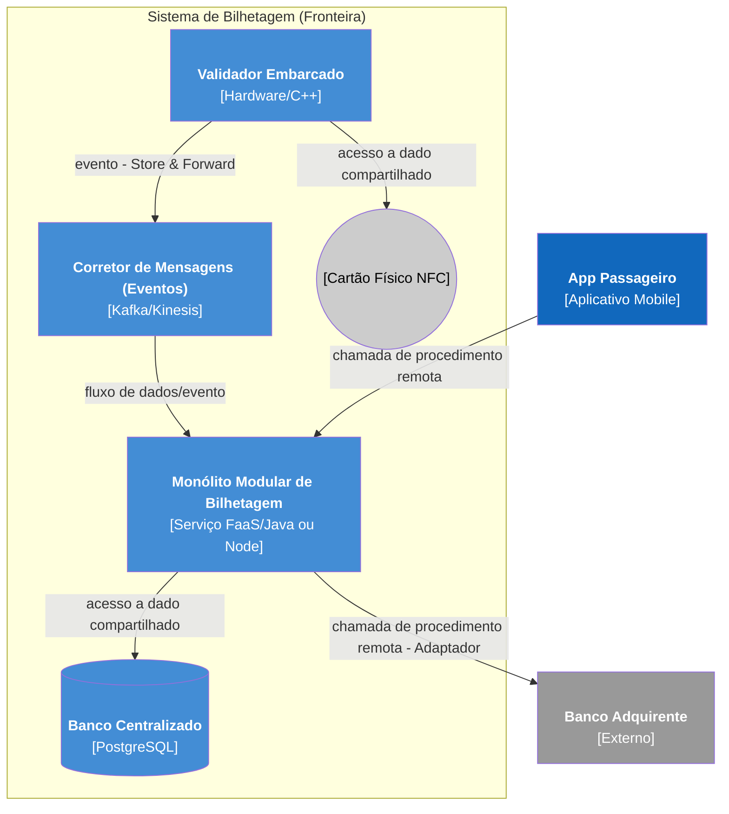
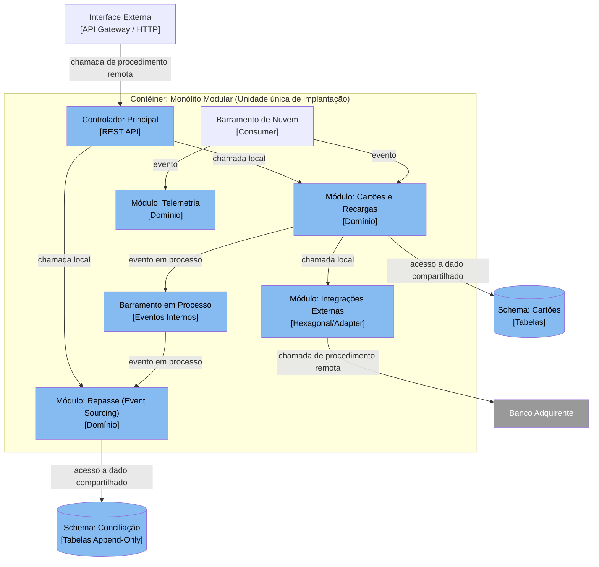

# Documentação Arquitetural: Sistema de Bilhetagem e Mobilidade

## 1. Mapa de Restrições e Decisões

| Restrição / Requisito | Decisão Arquitetural |
| :--- | :--- |
| **Equipe de 6 devs, sem operação, prazo 6 meses** | Adoção de **Monólito Modular** como topologia principal para rápida integração, implantação única e baixo custo operacional. |
| **Nuvem paga por uso, custo enxuto** | Implantação em contêineres serverless sob demanda (ex: Cloud Run/Fargate), escalando a zero fora do pico. |
| **Validação sem rede (offline) em até 300 ms** | Processamento local (Edge) no ônibus. O Validador atua como nó autônomo com réplica de regras e saldo no cartão físico (Smartcard NFC). |
| **Telemetria de alta carga intermitente** | Limite de fronteira com **Arquitetura Orientada a Eventos**. Uso de um serviço gerenciado de fila/tópico para absorver picos de GPS, desacoplado do monólito transacional. |
| **Repasse mensal sujeito a recálculo de regras** | Uso parcial de **Event Sourcing** apenas no subdomínio de saldo/repasse. A viagem é gravada como fato imutável para projeções financeiras futuras. |
| **Integração com terceiros (bancos, legado)** | Padrão **Hexagonal (Ports and Adapters)** no módulo de integração, isolando contratos de terceiros do núcleo de domínio. |
| **LGPD (direito ao esquecimento) vs. Conciliação** | **Destruição Criptográfica (Crypto-shredding)**. O ID do passageiro nos eventos de repasse é criptografado; apagar a chave exclui o dado pessoal mantendo a volumetria da viagem para auditoria. |

---

## 2. Registros de Decisões Arquiteturais (ADRs)

### ADR 0001: Adotar monólito modular como estrutura geral do sistema central
*   **Status:** aceito
*   **Contexto:** O prazo para a primeira versão é de seis meses, o caixa é limitado e a startup possui seis desenvolvedores sem equipe de operações. O domínio abrange validação, cartões, telemetria, passageiros e integrações. Subdividir em microsserviços geraria alto custo de infraestrutura e sobrecarga de DevOps precoce.
*   **Decisão:** Adotar o Monólito Modular para o sistema central na nuvem, com fronteiras físicas (pacotes) separando subdomínios, interfaces públicas estritas por módulo e dados em esquema (schema) lógico separado por módulo no banco de dados.
*   **Alternativas consideradas:**
    *   *Microsserviços:* Descartada devido à alta complexidade inicial de deploy, latência e custo operacional injustificável para o tamanho do time.
    *   *Monólito em Camadas:* Descartada, pois a lógica de cartões, repasses e telemetria geraria rapidamente uma bola de lama (big ball of mud) se separados apenas por infraestrutura/domínio geral.
*   **Consequências:**
    *   **Positivas:** Uma única unidade de implantação, reduzindo custo de CI/CD e monitoramento; latência inter-módulos quase nula; facilita a extração futura caso um módulo (ex: telemetria) precise escalar separadamente.
    *   **Negativas:** Escala vertical para todos os módulos; uma falha catastrófica de memória em um módulo derruba a aplicação inteira.

### ADR 0002: Empregar Destruição Criptográfica (Crypto-shredding) para eventos de repasse
*   **Status:** aceito
*   **Contexto:** O órgão exige recálculo retroativo de repasses, o que força o armazenamento do histórico de viagens sem mutação (append-only). Simultaneamente, a LGPD exige o direito ao esquecimento, e o sistema não pode quebrar a auditoria financeira caso uma viagem perca sua identificação nominal.
*   **Decisão:** Usar Destruição Criptográfica nos dados sensíveis armazenados na base de viagens/repasses. Cada passageiro possuirá uma chave de criptografia única; o identificador dele no evento financeiro será cifrado com ela.
*   **Alternativas consideradas:**
    *   *Apagar o registro inteiro (DELETE):* Descartada porque corromperia a volumetria mensal auditável da operadora.
    *   *Anonimização manual via UPDATE:* Descartada por ferir o princípio da imutabilidade no cálculo do repasse e gerar sobrecarga nas projeções.
*   **Consequências:**
    *   **Positivas:** Permite "apagar" o usuário instantaneamente descartando sua chave criptográfica, enquanto o registro da viagem permanece válido para cálculos matemáticos.
    *   **Negativas:** Custos operacionais para gerenciamento do cofre de chaves (Key Management Service) e sobrecarga de CPU para cifrar/decifrar em tempo de leitura.

### ADR 0003: Adotar portas e adaptadores no módulo de integração externa
*   **Status:** aceito
*   **Contexto:** A startup precisará se integrar com sistemas de bancos adquirentes e com o sistema legado do órgão gestor para troca de contratos formais, lidando com formatos rígidos impostos e janelas de indisponibilidade externas.
*   **Decisão:** Isolar as integrações externas usando Arquitetura Hexagonal (Ports and Adapters) nas bordas do módulo de integração, mantendo o domínio agnóstico aos protocolos SOAP/HTTP dos terceiros.
*   **Alternativas consideradas:**
    *   *Mapeamento direto na camada de negócio (Anti-padrão):* Descartada por engessar a lógica de conciliação financeira aos caprichos de indisponibilidade do banco.
*   **Consequências:**
    *   **Positivas:** A lógica de repasse pode ser testada localmente via adaptadores falsos em memória (testabilidade alta) e blindada de mudanças de API de terceiros.
    *   **Negativas:** Criação de interfaces intermediárias (cerimônia extra) e tradução de dados (mapeamento), o que prolonga o tempo inicial de codificação.

### ADR 0004: Implantar núcleo via contêineres serverless sob demanda (Operação)
*   **Status:** aceito
*   **Contexto:** Não há equipe de operação. O sistema é cloud-native pay-as-you-go e possui picos extremos no rush (6h30-8h30) e quedas drásticas de madrugada.
*   **Decisão:** Empacotar o Monólito Modular em imagem de contêiner e orquestrá-lo usando um serviço de Serverless Containers (ex: Fargate ou Cloud Run). O roteamento HTTP interno vai disparar o provisionamento (scale-out) baseado em CPU.
*   **Alternativas consideradas:**
    *   *Cluster Kubernetes Dedicado (EKS/GKE):* Descartado. Operar plano de controle do K8s exige tempo que as seis pessoas da equipe não têm.
    *   *Instâncias EC2/VMs fixas:* Descartado. Geraria capacidade ociosa de madrugada, desperdiçando o fluxo de caixa.
*   **Consequências:**
    *   **Positivas:** O custo reflete exatamente o tráfego da rede, autoescala gerida pelo provedor da nuvem, carga zero de manutenção de Sistema Operacional.
    *   **Negativas:** Latência de inicialização (Cold Start) durante variações bruscas de carga, limitando as opções de otimização de tempo de boot da plataforma.

### ADR 0005: Adotar eventos assíncronos (Store-and-Forward) para sincronia offline do validador
*   **Status:** aceito
*   **Contexto:** O validador do ônibus sofre latência e falhas contínuas de 4G, ficando offline por até 4 horas. Ele precisa aprovar/rejeitar passagens em 300ms e prevenir fraudes e dupla utilização com rapidez.
*   **Decisão:** O validador operará como um nó autônomo. O saldo e regras residem fisicamente no Smartcard (Mifare/Desfire) do usuário. O validador grava as "viagens_registradas" localmente e usa o padrão "Store and Forward": assim que detecta o 4G, publica as viagens como eventos no barramento da nuvem em lote.
*   **Alternativas consideradas:**
    *   *Requisição síncrona na hora do giro:* Descartada devido ao tempo de timeout estourar os 300 ms em zonas de sombra de cobertura.
*   **Consequências:**
    *   **Positivas:** 100% de disponibilidade no momento do embarque. Rápida ingestão no retorno de sinal.
    *   **Negativas:** A prevenção de reutilização da mesma passagem em ônibus distintos na mesma hora torna-se baseada em consistência eventual, exigindo regras de bloqueio compensatórias aplicadas a posteriori (lista negativa enviada de volta aos ônibus).

---

## 3. Respostas às Perguntas Obrigatórias

1.  **Como o validador aceita a passagem sem rede, e como o sistema descobre depois que a mesma passagem foi usada em dois ônibus?**
    *   *Resposta:* O validador (desenhado no nível de contêineres) atua em modo autônomo, efetuando o débito fisicamente no chip do cartão RFID (fonte da verdade de saldo) e gravando um log local do evento. A descoberta da "dupla utilização" fraudulenta ocorre de forma eventual: quando ambos os ônibus readquirem 4G, transmitem os eventos ao barramento de nuvem (**ADR 0005**). O módulo de Conciliação detecta anomalias (ex: check-ins geograficamente impossíveis em curto espaço de tempo) e emite um evento de bloqueio. O cartão é inserido em uma *Blocklist* que é disseminada (via broadcast assíncrono) para todos os validadores da frota.

2.  **Como o saldo do cartão fica consistente entre recarga no aplicativo e uso no ônibus, com atraso de sincronização?**
    *   *Resposta:* O saldo é descentralizado. Quando o passageiro compra crédito no app, a recarga fica "pendente" no banco de dados central. Essa pendência desce via barramento para os validadores online (**diagrama nível 2**). Ao bater o cartão no ônibus (mesmo offline), se o validador já tiver baixado a pendência da placa do veículo antes de perder sinal, ele "escreve" o saldo novo no chip. Se não, o saldo validado é puramente o que o chip portar naquele momento. A consistência é eventual por natureza e orquestrada pelo próprio cartão sendo o repositório de estado (Event-carried state transfer híbrido).

3.  **Como a telemetria escala no pico sem derrubar o restante do sistema?**
    *   *Resposta:* A telemetria possui uma arquitetura híbrida na fronteira: a ingestão no lado da nuvem não é feita via chamada síncrona (REST) contra o monólito. O validador deposita (conector: *fluxo de dados/evento*) no Barramento de Eventos Gerenciado (Kinesis/Kafka Serverless). O monólito modular reage aos eventos conforme sua capacidade (consumidor passivo com *backpressure*), blindando o núcleo transacional da volumetria (5x picos de 80 GPS/s). (**Conector de eventos no diagrama nível 2**).

4.  **Como o repasse mensal é recalculado se uma regra de tarifa mudou no meio do mês?**
    *   *Resposta:* Baseado no uso localizado de *Event Sourcing* para cálculos. Toda validação que sobe do ônibus é gravada de modo *append-only* (fato imutável com data retroativa de quando o cartão rodou). O fechamento financeiro é uma Projeção (Projection / CQRS Read Model). Se a regra tarifária retroagir, descarta-se a projeção atual daquele mês e reproduz-se (re-play) o fluxo do repositório de eventos passando pelas novas regras no projetor (**ADR 0001, referenciando separação de pacotes**).

5.  **Como o histórico de viagens de uma pessoa é apagado quando ela pede, sem quebrar a conciliação financeira?**
    *   *Resposta:* Através de Crypto-Shredding (**ADR 0002**). Todos os eventos guardam o ID do cartão/usuário de maneira ofuscada por criptografia cujas chaves mestras individuais estão no módulo de Cadastros (KMS). Se a LGPD for invocada, o sistema apaga permanentemente a chave de decifragem do usuário, impossibilitando qualquer mapeamento "pessoa <-> evento". Porém, o evento de viagem contendo `$2,50 debitados à 14h` e o identificador opaco persistem perfeitamente utilizáveis matematicamente para totalização financeira pela auditoria.

---

## 4. Diagramas C4

### C4 Nível 1: Contexto

### C4 Nível 2: Contêineres

### C4 Nível 3: Componentes (Do Contêiner: Monólito Modular)

